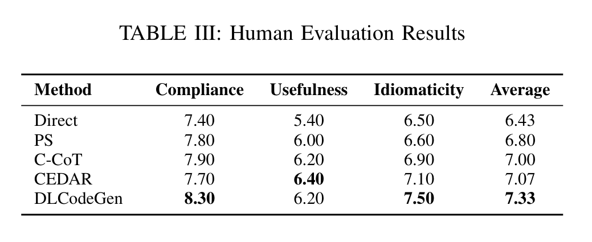

# DLCodeGen
This artifact for our paper "Empowering AI to Generate Better AI Code: Guided Generation of Deep Learning Projects with LLMs" includes benchmark suite, results, materials and source code. We hope this artifact can motivate and help future research on code generation.

## What's inside the artifact:
1.Three datasets for deep learning code generation evaluation. Located in [./Datasets](./Datasets).  
2.Source code for deep learning code generation. Located in [./DLCodeGeneneration](./DLCodeGeneration/).  
3.Experimental results for research questions (RQs). Located in [./Results](./Results/).

## Approach Overview
We introduce DLCodeGen, a novel planning guided deep learning code generation method. Our approach
 involves training a model on a meticulously curated parallel corpus to produce solution plans that align precisely with user requirements, ensuring the structural consistency and logical coherence of the generated code. A  comparative learning mechanism is subsequently employed to integrate outputs from Code RAG and Template RAG, significantly enhancing the quality of the final code.

  

## Benchmark
   - **DLCodeEval**: Designed to evaluate the quality of generated deep learning code. To prevent data leakage, we select notebook files with execution timestamps after 2024 and verify using LLMs that they have not been exposed to these content. Located in [./Datasets/DLCodeEval](./Datasets/DLCodeEval)
   - **DLSamplePool**: A curated collection of high-quality deep learning code samples. Each sample is manually reviewed to ensure its relevance and quality. Located in [./Datasets/DLSamplePool](./Datasets/DLSamplePool/)
   - **DLPlanData**: Designed for training, evaluating, and testing the solution plan predictor. Located in [./Datasets/DLPlanData](./Datasets/DLPlanData/)

The statistics of the datasets are summarized below:  

  

## Evaluation Results 
We conduct a comprehensive evaluation to assess the performance and characteristics of DLCodeGen in deep learning code generation. The results for each research question (RQ) are organized as follows:  

**RQ1: How effective is DLCodeGen in deep learning code generation?**  
  → Full evaluation rresults are available in [./Results/RQ1](./Results/RQ1).

  

  

**RQ2: Whether the deep learning code generated by DLCodeGen are compliant, useful and idiomatic?**  
  → Refer to the lower section of **TABLE II** for detailed results.    
  → Full evaluation results are available in [./Results/RQ2](./Results/RQ2).   

**RQ3: How well does the plan prediction model perform?**  
  → Full evaluation results are available in [./Results/RQ3](./Results/RQ3).  

  

  

**RQ4: What is the contribution of each component in DLCodeGen?**  
  → Full evaluation results are available in [./Results/RQ4](./Results/RQ4).  

  

**RQ5: How does the temperature setting in LLMs affect performance?**  
  → Full evaluation results are available in [./Results/RQ5](./Results/RQ5).  

  

